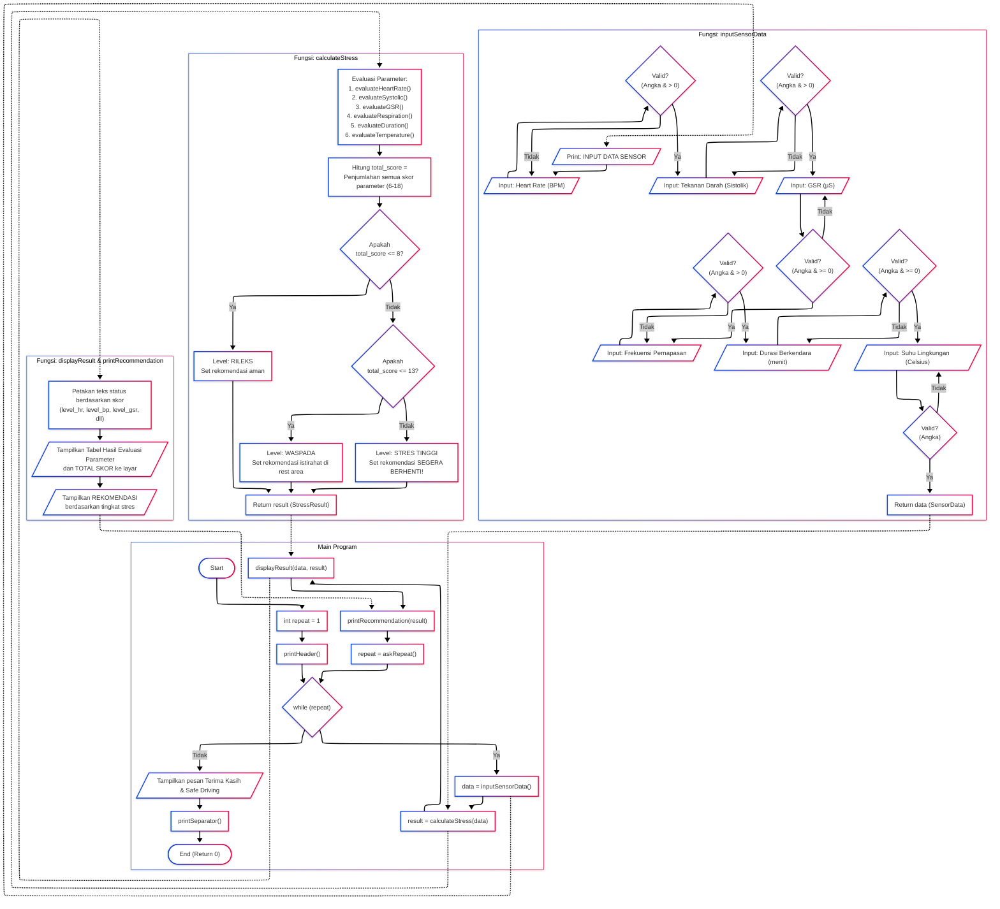

# Final-Project-PROGDAS

## Judul
Sistem Monitoring Stress Pengendara

## Tujuan
Sistem ini dibuat untuk mencegah insiden road-rage di jalan raya

## Anggota Kelompok 2:
| NPM            | Nama                            | Username GITHUB  |
| -------------- | ------------------------------- | ---------------- |
| 2506535140     | Alystio Steven Xiang            | AlystioSteven-05 |
| 2506593525     | Benedict Jaysen Riofo Panjaitan | ZFrees           |
| 2506611736     | Jeremi Natama Simanjuntak       | Loafietheman     |

## Rubik Penilaian

## Ketentuan
Submission is through EMAS with the following file:
1. Final Program with a .c extension. If separate header files exist, all programs must be zipped into one file.
2. Program executable file (.exe)
3. A Github link (URL is written inside the report). It should be clear who did what
4. Video presentation in Youtube, unlisted. The explation should follow the order of the rubric (see Section III). Duration: 5 – 8 minutes (URL is written inside the report).
5. A report in PDF format. Generally, the report should use font Arial 11 pt, single space, no space before & after paragraph, except the flowchart and source code. The report should include all of this elements:

- Pg 1: Cover
- Pg 2: Video presentation URL & Github URL
- Pg 3: Task division for each group member written in detail & the username in github. Everyone should have clear contribution in making the program, i.e. which block, shich function.
- Pg 4: A brief explanation of the program's theme (no more than 1 page)
- Pg 5 etc: List of variables, arrays, structs, etc., and their uses.
- List of functions and their uses.
- Main program Flowchart. Arial narrow, 9 pt
- Each function flowchart. Arial narrow, 9 pt
- A copy of the source code with the following specifications: font: Lucida Console, 10pt, single space, no space before or after paragraphs, etc.
- Screen capture of the running program (not the code), for all cases.

## Parametrix yang digunakan
**1. Vital Signs**
| Kondisi        | Heart Rate (BPM)                | Tensi (Sistolik) |
| -------------- | ------------------------------- | ---------------- |
| Rileks         | 60 - 80                         | < 120 mmHg       |
| Waspada        | 81 - 100                        | 120 - 129 mmHg   |
| Stress Tinggi  | > 100                           | >= 130 mmHg      |

**2. Keringat(GSR)**
| Kondisi        | microSiemens (µS)               |
| -------------- | ------------------------------- |
| Normal         | < 5 µS                          | 
| Tegang         | 5 - 10 µS                       | 
| Stress         | > 10 µS                         | 

**3. Respiration Rate**
| Kondisi            | Breaths Per Minute(brpm)        |
| ------------------ | ------------------------------- |
| Normal/Rileks      | 12 - 20 brpm                    | 
| Tegang/Napas Cepat | 21 - 25 brpm                    | 
| Emosi/Napas Pendek | > 25 brpm                       | 

**4. Lama Berkendara**
| Kondisi               | Lama Berkendara (menit)         |
| --------------------- | ------------------------------- |
| Baru berkendara       | < 60 Menit                      | 
| Masuk fase jenuh      | 60 - 119 Menit                  | 
| Rawan krisis kognitif | >= 120 Menit nonstop            | 

**5. Suhu Lingkungan**
| Kondisi               | Temperature (Celcius)           |
| --------------------- | ------------------------------- |
| Sejuk / Optimal       | 20 - 25 Celcius                 | 
| Agak Panas            | 26 - 29 Celcius                 | 
| Panas Memicu Emosi    | >= 30 Celcius                   | 

## Jobs Desc
|           Nama             |            Peran           |
| -------------------------  | -------------------------- |
| Alystio Steven Xiang       | Arsitektur program, logika evaluasi parameter fisiologis (Heart Rate, Tekanan Darah, GSR) |
| Benedict Jaysen Riofo Panjaitan | Logika evaluasi pernapasan & durasi, kalkulasi skor total & klasifikasi stress |
| Jeremi Natama Simanjuntak  | Evaluasi suhu lingkungan, tampilan hasil, sistem rekomendasi, validasi input, dokumentasi |

## Workflow Program

## Referensi
1. Acuan Heart Rate & Keringat (GSR)
   Healey, J. A., & Picard, R. W. (2005). Detecting Stress During Real-World Driving Tasks Using Physiological Sensors. IEEE Transactions on Intelligent Transportation Systems.
2. Acuan Suhu Lingkungan
   Daanen, H. A. M., dkk. (2003). Driving performance in cold, warm, and thermoneutral environments. Applied Ergonomics.
3. Respirasi & Napas Pendek
   Wilhelm, F. H., Gevirtz, R., & Roth, W. T. (2001). Respiratory dysregulation in anxiety, functional cardiac, and pain disorders. Behavior Modification.
4. Acuan Durasi Berkendara
   Kementerian Kesehatan Republik Indonesia. (2020). Pedoman Kesehatan Keselamatan Berkendara
